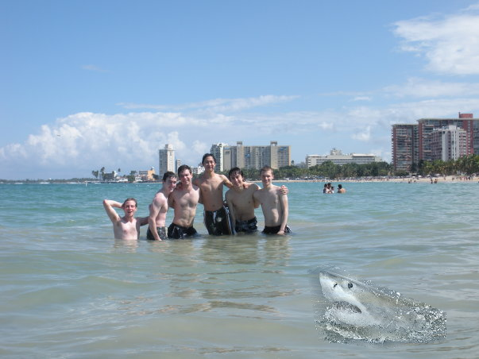
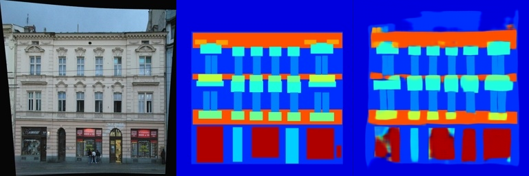
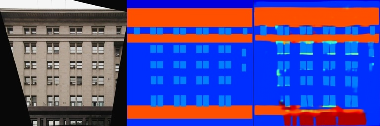
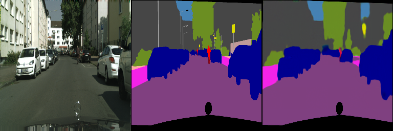
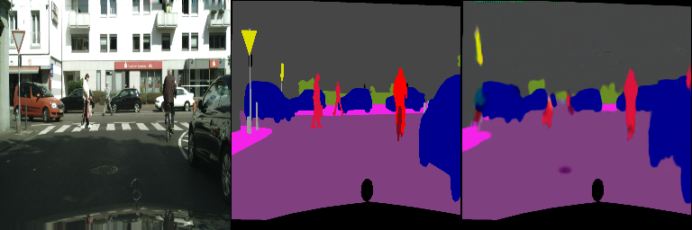

# Assignment 2 - DIP with PyTorch

## DIP with PyTorch

This repository is the implementation of Assignment_02 of DIP.



## Requirements

To install requirements:

```setup
python -m pip install -r requirements.txt
```

## Running

To run poisson blending, run:

```poisson
python run_blending_gradio.py
```

To run Pix2Pix, run:

```Pix2Pix
python infer.py
```

## Results

### Poisson Blending


### Pix2Pix






## Acknowledgement

>📋 Thanks for the algorithms proposed by
[Poisson Image Editing](https://www.cs.jhu.edu/~misha/Fall07/Papers/Perez03.pdf),
[Pix2Pix](https://phillipi.github.io/pix2pix/) and
[Fully Convolutional Layers](https://arxiv.org/abs/1411.4038).
