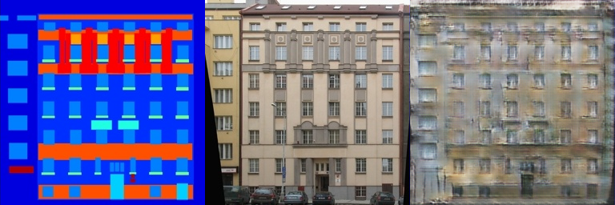
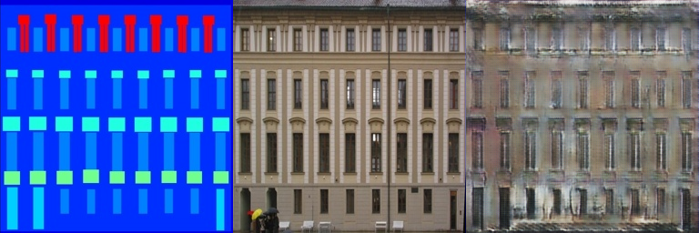

# Assignment 3 - Play with GANs

## Play with GANs

This repository is the implementation of Assignment_03 of DIP.

## Requirements

To install requirements:

```setup
python -m pip install -r requirements.txt
```

## Running

To run AutoDrag, run:

```AutoDrag
cd DragGAN
python .\visualizer_drag_gradio.py
```

To run GACNN, run:

```GACNN
python infer.py
```

## Results

### AutoDrag


### GACNN




## Acknowledgement

>📋 Thanks for the algorithms proposed by
[DragGAN](https://vcai.mpi-inf.mpg.de/projects/DragGAN/) and
[Generative Adversarial Nets](https://arxiv.org/abs/1406.2661)
